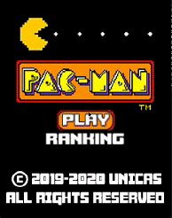
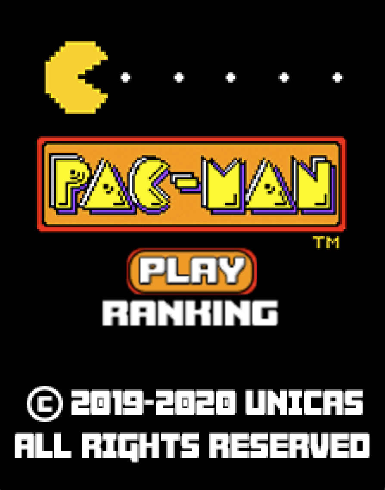
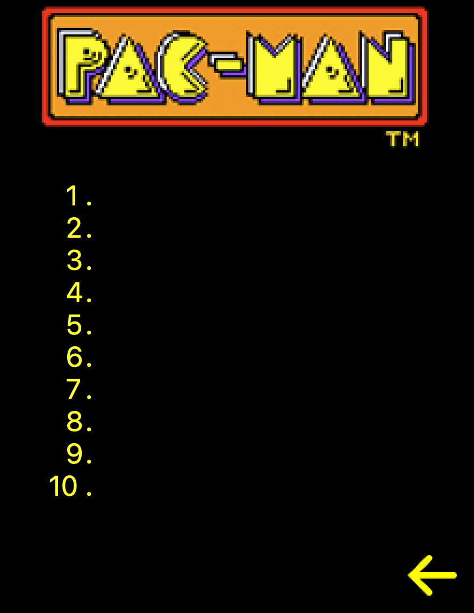
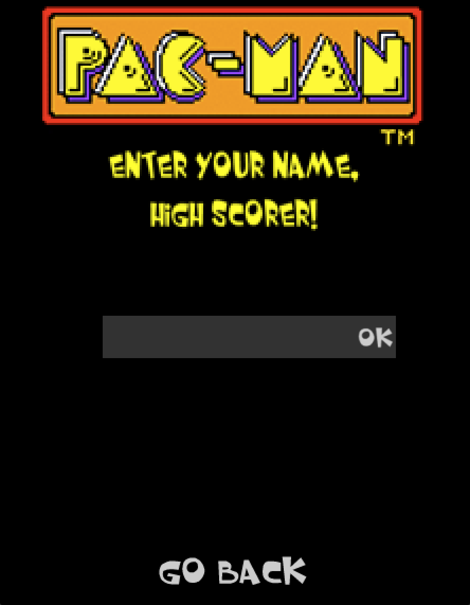
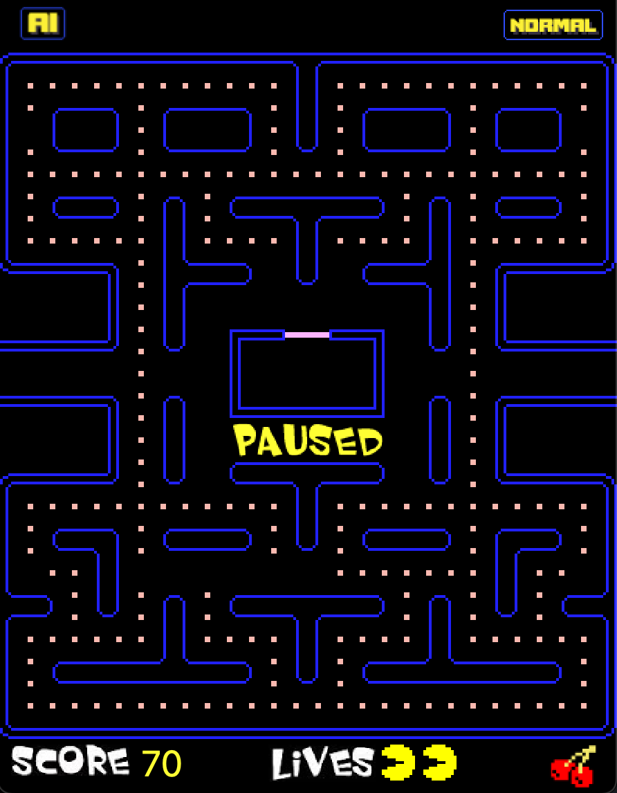
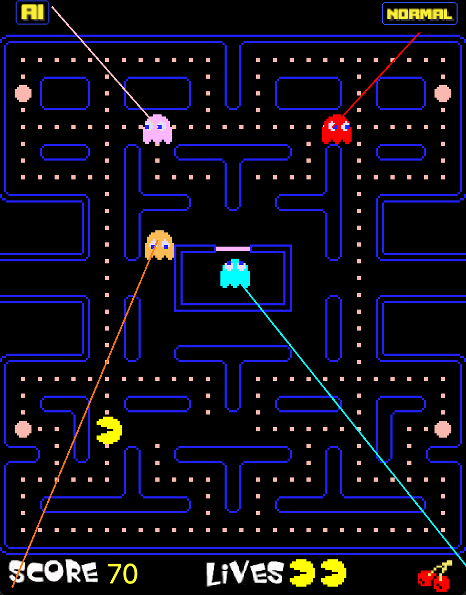
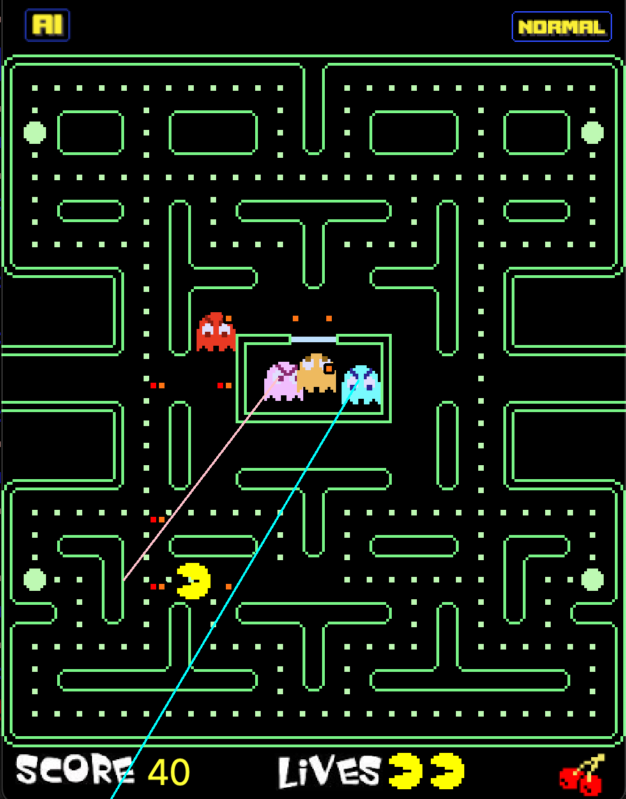

# Impossible Pacman
Pacman game implementation in C++ and Qt with artificial intelligence mode using Floyd-Warshall algorithm for shortest path.

  

# Requirements
- Qt library

# How to run it
Build the project using CMake:
1. Clone the repository and select it as source code.
2. Select the destination folder that will contain the built project.
3. Click Configure.
4. Choose *Unix Makefiles* and *Default native compilers*.
5. Add the Qt library path if they are not founded. Otherwise you can specify your paths inside the CMakeLists.txt.
3. Generate.
4. Open the project folder from terminal, run the command "make", wait the compiling, then you can launch the game with "./impossiblepacman"

Note: No matter which compiling solution you use. You can build the project also using one of the IDE project that can be created with CMake (e.g. Xcode, Eclipse etc.).

# Game logic
The classic pacman rules are implemented. We have 4 ghosts:

1. **Blinky** (red)
2. **Pinky** (pink)
3. **Inky** (cyan)
4. **Clyde** (orange)

Ghosts have different modes:
- **Chase**: ghosts actively pursue Pacman based on their individual targeting logic:

    - Blinky directly targets Pacman’s current position.
    - Pinky targets a position 4 tiles ahead of Pacman. If Pacman is moving up it adjust with other 4 tiles on the left.
    - Inky targets a tile that is 2 tiles directly ahead of Pacman in his current direction. If Pacman is moving up, Inky targets a tile that is 2 tiles ahead of Pacman in his current direction and then 2 tiles to the left of that position. Once Inky has determined Pacman's target tile (as described above), he then takes Blinky's position into account. Imagine a line drawn from Blinky's current position to the target tile calculated in the first step. Extend this line an equal distance beyond the target tile, effectively rotating the target by 180 degrees around the target tile. The end of this extended line (the point beyond the original target tile) becomes Inky's final target. This targeting method often causes Inky to coordinate with Blinky to trap Pacman between them.
    - Clyde alternates between targeting Pacman and moving to the bottom-left corner based on his distance from Pacman.
- **Scatter**: ghosts temporarily stop chasing Pacman and instead move to their respective corners of the map:
    - Blinky moves to the top-right corner.
    - Pinky moves to the top-left corner.
    - Inky moves to the bottom-right corner.
    - Clyde moves to the bottom-left corner.
- **Frightened**: ghosts can be eaten by Pacman.

The different modes change following this sequence:
1. Scatter for 7 seconds, Chase for 20 seconds.
2. Scatter for 7 seconds, Chase for 20 seconds.
3. Scatter for 5 seconds, Chase for 20 seconds.
4. Scatter for 5 seconds, Chase until the end of the level.

Ghosts can change their direction only when they have arrived on a node of the map.

If Pacman dies or the level is completed, the cycle resets. Additionally, when only 20 pieces of food remain, Blinky permanently enters Scatter mode. Ghosts are slightly faster than Pacman.

When Pacman eats a power pellet, all ghosts enter Frightened mode. In this mode, ghosts turn blue, move more slowly, and can be eaten by Pacman for extra points. Their movement logic also changes—they reverse their current direction and start moving randomly.

If Pacman eats a ghost in Frightened mode, the ghost enters Eaten mode. The ghost’s appearance changes to just a pair of eyes, and it heads directly back to the starting gate. Once there, it returns to its normal form and resumes either Scatter or Chase mode, depending on the current cycle.

# How to play it
The game open with a welcome window:  

 

You can click on:

- **Play**: to play the normal pacman game mode.  
  
Pacman is controlled using the arrow keys on your keyboard.

If you want to change the game mode, on the top of the screen there are two buttons:
- **Normal**: to play in the current normal mode.  
   

- **AI**: to play the AI version where Blinky and Clyde are powered with the Floyd-Warshall algorithm for shortest path, while the other ghosts are in permanent Chase mode.
After you selected your game mode, you will be redirected to the welcome window, and clicking again on "Play" you will play in the selected mode. You can recognize it because the ghosts will have an angry face and the map will blink in RGB colors 
   

- **Ranking**: to see the ranking scores saved.  
  
The 10 best saved scores are shown:  
  
Click on the yellow arrow to go back to the welcome window.

Once your lives are finished or you finished all the food, you will see a "Game over" or "You Win!" message. 

  
  

The ranking window will appear to save your score. Insert your name into the text box and click "Ok" to save it, or click "Go back" to come back to the welcome window and not save your score.

# Shortcuts
- P: paused the game. Click it again to continue to play.  
      

- T: show the ghost's target.

    Normal mode:  
    

    AI mode:  
    
